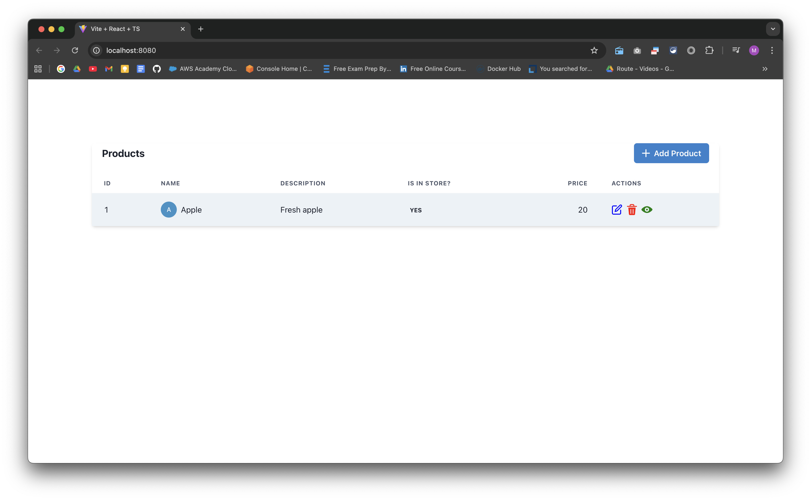

# 3-Tier Docker Application with Ansible Deployment

A fully automated deployment solution for a 3-tier web application using Docker, Docker Compose, and Ansible. This project demonstrates infrastructure as code principles with support for both Debian and RedHat-based Linux distributions.



## 📋 Table of Contents

- [Overview](#overview)
- [Architecture](#architecture)
- [Prerequisites](#prerequisites)
- [Quick Start](#quick-start)
- [Project Structure](#project-structure)
- [Configuration](#configuration)
- [Deployment](#deployment)
- [Verification](#verification)
- [Troubleshooting](#troubleshooting)
- [Useful Commands](#useful-commands)
- [Contributing](#contributing)

## 🎯 Overview

This project provides an automated deployment pipeline for a 3-tier application consisting of:

- **Frontend**: React application served on port 8080
- **Backend**: .NET API application on port 5033
- **Database**: MySQL 8.0 database with persistent storage

The deployment is fully automated using Ansible, supporting both local development and production environments.

## 🏗️ Architecture

```
┌─────────────────────────────────────────────────────┐
│                   User Browser                      │
└──────────────────────┬──────────────────────────────┘
                       │
                       ▼
┌─────────────────────────────────────────────────────┐
│              Frontend (React)                       │
│              Port: 8080                             │
│              Network: front-back                    │
└──────────────────────┬──────────────────────────────┘
                       │
                       ▼
┌─────────────────────────────────────────────────────┐
│              Backend (.NET API)                     │
│              Port: 5033                             │
│              Networks: front-back, back-db          │
└──────────────────────┬──────────────────────────────┘
                       │
                       ▼
┌─────────────────────────────────────────────────────┐
│              Database (MySQL 8.0)                   │
│              Port: 3306 (internal)                  │
│              Network: back-db                       │
│              Volume: db-data (persistent)           │
└─────────────────────────────────────────────────────┘
```

## ✅ Prerequisites

### System Requirements
- **OS**: Ubuntu 20.04+, Debian 10+, CentOS 7+, RHEL 8+, Rocky Linux 8+
- **RAM**: Minimum 2GB (4GB recommended)
- **Disk**: Minimum 10GB free space
- **Network**: Internet connection for downloading packages

### Software Requirements
- Python 3.6+
- Ansible 2.9+
- sudo/root access

### Initial Setup

```bash
# Install Ansible (Ubuntu/Debian)
sudo apt update
sudo apt install -y ansible

# Install Ansible (CentOS/RHEL)
sudo yum install -y ansible

# Verify installation
ansible --version
```

## 🚀 Quick Start

### 1. Clone the Repository

```bash
git clone https://github.com/yourusername/docker-ansible-project.git
cd docker-ansible-project
```

### 2. Configure Variables

```bash
# Create vars directory
mkdir -p vars

# Copy the example configuration
cp vars-main-simple.yml vars/main.yml

# Edit configuration (set your database password)
nano vars/main.yml
```

**vars/main.yml:**
```yaml
---
DB_PASSWORD: YourSecurePassword123!
```

### 3. Deploy the Application

```bash
# Run the Ansible playbook
ansible-playbook playbook.yml
```

### 4. Access Your Application

- **Frontend**: http://localhost:8080
- **Backend API**: http://localhost:5033/api
- **Swagger Documentation**: http://localhost:5033/swagger (if enabled)

## 📁 Project Structure

```
Docker-Ansible-Project/
├── README.md                       # This file
├── playbook.yml                    # Main Ansible playbook
├── docker-compose.yml              # Docker Compose configuration
├── check-health.sh                 # Health check script
├── screenshot.png                  # Application screenshot
├── vars/
│   ├── main.yml                    # Main configuration file
│   └── secrets.yml                 # Optional encrypted secrets (Ansible Vault)
├── React-Frontend/
│   ├── Dockerfile                  # Frontend container definition
│   ├── package.json
│   ├── src/
│   └── public/
├── DotNet-Backend/
│   ├── Dockerfile                  # Backend container definition
│   ├── *.csproj
│   ├── Controllers/
│   ├── Models/
│   └── Program.cs
└── docs/
    ├── QUICK_START.md              # Quick start guide
    ├── HOW_TO_CHECK_APP.md         # Application verification guide
    ├── UNDERSTANDING_404.md        # Backend health check explanation
    ├── DEPLOYMENT_WORKFLOWS.md     # Deployment options
    └── VAULT_SOLUTIONS.md          # Ansible Vault guide
```

## ⚙️ Configuration

### Basic Configuration (vars/main.yml)

```yaml
---
# Required: Database password
DB_PASSWORD: YourSecurePassword123!

# Optional: Cleanup secrets after deployment
cleanup_secrets: false

# Optional: Docker Hub credentials (only if pushing images)
DOCKER_USERNAME: yourusername
DOCKER_PASSWORD: yourtoken
```

### Advanced Configuration

For advanced options including:
- Building and pushing to Docker Hub
- Using Ansible Vault for secrets
- Custom deployment modes

See [DEPLOYMENT_WORKFLOWS.md](docs/DEPLOYMENT_WORKFLOWS.md)

## 🔧 Deployment

### Standard Deployment (Local Development)

```bash
ansible-playbook playbook.yml
```

This will:
1. ✅ Install Docker and Docker Compose
2. ✅ Create necessary secrets files
3. ✅ Build Docker images locally
4. ✅ Start all containers
5. ✅ Verify application health
6. ✅ Display deployment summary

### Deployment Options

```bash
# Deploy with verbose output
ansible-playbook playbook.yml -v

# Deploy with specific user
ansible-playbook playbook.yml --become-user=youruser

# Check what would happen (dry run)
ansible-playbook playbook.yml --check

# Run only specific tasks (using tags, if configured)
ansible-playbook playbook.yml --tags docker
```

## ✔️ Verification

### Automated Health Check

```bash
# Run the health check script
./check-health.sh
```

Expected output:
```
=============================================
   3-Tier App Health Check
=============================================

1️⃣  Checking Docker Containers...
NAME       STATUS
frontend   Up
backend    Up
db         Up (healthy)

2️⃣  Testing Services...
✅ Frontend (port 8080) is responding
✅ Backend (port 5033) is responding
✅ Database is responding

=============================================
   Summary
=============================================
✅ All services are healthy! (3/3)

Access your application:
  Frontend: http://localhost:8080
  Backend:  http://localhost:5033
```

### Manual Verification

```bash
# Check container status
docker compose ps

# Test frontend
curl http://localhost:8080

# Test backend API
curl http://localhost:5033/api

# View application logs
docker compose logs -f

# Check specific service logs
docker compose logs backend
```

## 🐛 Troubleshooting

### Common Issues

#### Containers Not Starting

```bash
# Check logs for errors
docker compose logs

# Check specific service
docker compose logs backend

# Restart services
docker compose restart
```

#### Port Already in Use

```bash
# Find process using the port
sudo lsof -i :8080
sudo lsof -i :5033

# Stop the conflicting service or change ports in docker-compose.yml
```

#### Database Connection Errors

```bash
# Verify database password
cat db_password.txt

# Check database logs
docker compose logs db

# Test database connection
docker compose exec db mysql -u root -p
```

#### Permission Denied Errors

```bash
# Add your user to docker group
sudo usermod -aG docker $USER

# Logout and login again, or run:
newgrp docker

# Verify docker access
docker ps
```

### Getting Detailed Diagnostics

```bash
# Full diagnostic information
docker compose ps
docker compose logs --tail=100
docker stats --no-stream
docker network ls
docker volume ls

# Check system resources
df -h
free -h
```

For more troubleshooting help, see:
- [HOW_TO_CHECK_APP.md](docs/HOW_TO_CHECK_APP.md)
- [UNDERSTANDING_404.md](docs/UNDERSTANDING_404.md)

## 📚 Useful Commands

### Docker Compose Commands

```bash
# Start all services
docker compose up -d

# Start with rebuild
docker compose up -d --build

# Stop all services
docker compose down

# Stop and remove volumes
docker compose down -v

# Restart specific service
docker compose restart backend

# View logs (follow mode)
docker compose logs -f

# View logs for specific service
docker compose logs -f frontend

# Scale services (if configured)
docker compose up -d --scale backend=3

# Execute command in container
docker compose exec backend bash
```

### Ansible Commands

```bash
# Run playbook
ansible-playbook playbook.yml

# Run with verbose output
ansible-playbook playbook.yml -vvv

# Syntax check
ansible-playbook playbook.yml --syntax-check

# List all tasks
ansible-playbook playbook.yml --list-tasks

# Start from specific task
ansible-playbook playbook.yml --start-at-task="Task Name"
```

### Docker Commands

```bash
# List all containers
docker ps -a

# List images
docker images

# Remove unused containers
docker container prune

# Remove unused images
docker image prune

# Remove unused volumes
docker volume prune

# Clean everything (careful!)
docker system prune -a --volumes

# View resource usage
docker stats

# Inspect container
docker inspect backend
```

### Database Commands

```bash
# Connect to MySQL
docker compose exec db mysql -u root -p

# Backup database
docker compose exec db mysqldump -u root -p productsdb > backup.sql

# Restore database
docker compose exec -T db mysql -u root -p productsdb < backup.sql

# View databases
docker compose exec db mysql -u root -p -e "SHOW DATABASES;"
```

## 🔐 Security Considerations

### Production Deployment Checklist

- [ ] Use strong database passwords (minimum 16 characters)
- [ ] Enable Ansible Vault for sensitive data
- [ ] Use secrets management (Docker secrets, not environment variables)
- [ ] Implement SSL/TLS for frontend and backend
- [ ] Configure firewall rules (ufw, firewalld)
- [ ] Regular security updates
- [ ] Implement backup strategy
- [ ] Use non-root containers where possible
- [ ] Enable database encryption at rest
- [ ] Implement rate limiting
- [ ] Configure log rotation

### Using Ansible Vault

```bash
# Create encrypted secrets file
ansible-vault create vars/secrets.yml

# Edit encrypted file
ansible-vault edit vars/secrets.yml

# Run playbook with vault
ansible-playbook playbook.yml --ask-vault-pass
```

## 🚢 Production Deployment

For production environments, consider:

1. **Use a reverse proxy** (Nginx, Traefik)
2. **Enable SSL/TLS certificates** (Let's Encrypt)
3. **Configure proper logging** (ELK stack, Loki)
4. **Set up monitoring** (Prometheus, Grafana)
5. **Implement CI/CD pipeline** (Jenkins, GitLab CI, GitHub Actions)
6. **Use container orchestration** (Kubernetes, Docker Swarm)
7. **Configure backups** (automated database dumps)
8. **Set resource limits** in docker-compose.yml

## 🤝 Contributing

Contributions are welcome! Please follow these steps:

1. Fork the repository
2. Create a feature branch (`git checkout -b feature/AmazingFeature`)
3. Commit your changes (`git commit -m 'Add some AmazingFeature'`)
4. Push to the branch (`git push origin feature/AmazingFeature`)
5. Open a Pull Request

## 📝 License

This project is licensed under the MIT License - see the [LICENSE](LICENSE) file for details.

## 👥 Authors

- **Mohamed Essam** - *Initial work* - [mohamedessam955559](https://hub.docker.com/u/mohamedessam955559)

## 🙏 Acknowledgments

- Ansible community for excellent documentation
- Docker team for containerization platform
- React and .NET communities

## 📞 Support

For issues, questions, or contributions:

- **Issues**: [GitHub Issues](https://github.com/yourusername/docker-ansible-project/issues)
- **Documentation**: See `/docs` folder for detailed guides
- **Health Check**: Run `./check-health.sh` for automated diagnostics

## 📈 Roadmap

- [ ] Add Kubernetes deployment manifests
- [ ] Implement automated testing
- [ ] Add CI/CD pipeline examples
- [ ] Create Helm charts
- [ ] Add monitoring stack (Prometheus/Grafana)
- [ ] Implement horizontal scaling
- [ ] Add multi-environment support (dev/staging/prod)

---

**Made with ❤️ using Docker, Ansible, and Open Source**
